# Install MacOS VM in VirualBox 7.2.x

This is a walkthrough of how I installed a macOS Virtual Machine (VM) in the current version of VirtualBox at the time. It includes every step I took from start to finish with snapshots and an extra step to be taken for AMD CPUs.

Before proceeding, if you are going to follow along with this, make sure that virtualization is enabled on your machine.
1. Open Task Manager: Press `[Ctrl] + [Shift] + [Esc]` on your keyboard or right-click on the taskbar and click **Task Manager**.
2. Go to the **Performance** tab (left of the window) and click **CPU**.
3. Look at the bottom right for **Virtualization**.
    + If it says **Enabled**, you're good!
    + If it says **Disabled**, <a href="https://support.microsoft.com/en-us/windows/enable-virtualization-on-windows-c5578302-6e43-4b4b-a449-8ced115f58e1" target="_blank">Click Here</a> and follow the instructions to **Enable** it, then return here.
    + If it says **Not Supported**, your CPU does not support virtualization and you won't be able to get this done.


## Prerequisites
If you're sill here, the it must mean that your machine supports **Virtualization** and it's **Enabled**! In which case, proceed. Also, hope you got a few hours to spare. (foreshadowing...)

### Step 1: Install **VirtualBox** and **VirtualBox Extention Pack**
If you already have the most recent version of **VirtualBox** installed (7.2.8 at the time of writing this) as well as it's corresponding **Extenion Pack**, you may skip his step. Otherwise, you may continue.

First, you'll need to download and install **VirtualBox** and the **VirtualBox Extention Pack**.
<a href="https://www.virtualbox.org/wiki/Downloads" target="_blank">Click Here</a> or go to <https://www.virtualbox.org/wiki/Downloads> to find download links for both.

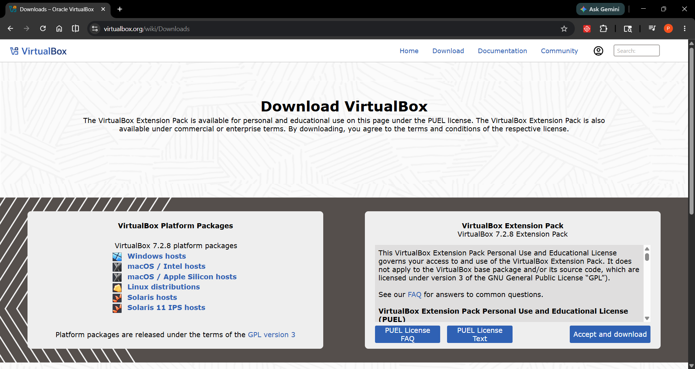

Under **VirtualBox Platform Packages**, click **Windows hosts** (assuming you're on a Windows machine if you're following this) to download the appropriate `.exe` file.

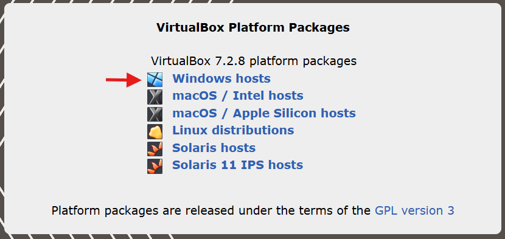

Once the download is finished, locate the file and run it. If you get a "**Do you want to allow this app to make changes to your device?**" screen (this will pop-up a lot through out his process), click **Yes** to continue. This will open he VirtualBox Installer wizard.

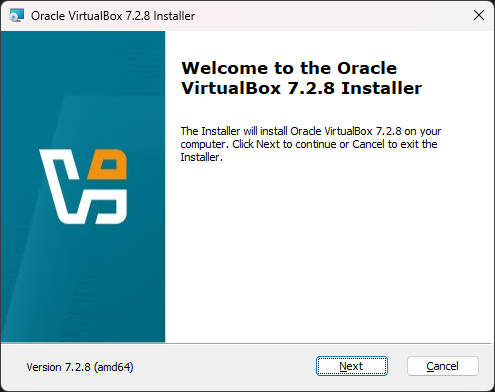

Simply follow the the Installer steps and when it's done, click **Finish**.

Next, back on the Downloads page, under **VirtualBox Extension Pack**, click the **Accept and download** button.

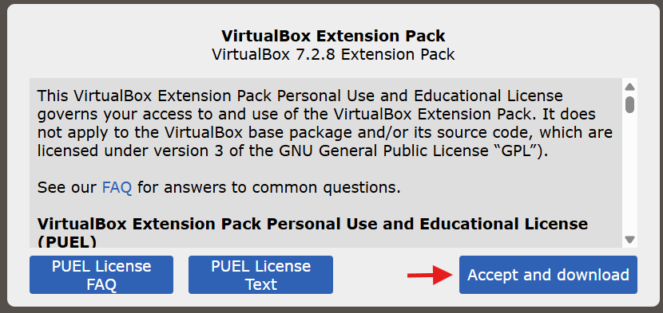

Once the download is finished, locate the file and run it. This will open up **VirtualBox** with a **Question** dialog box. Click the **Install** button.

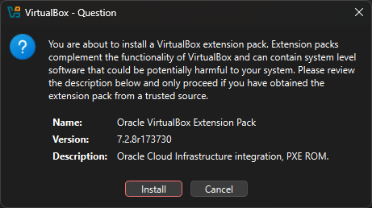

If you already have an older extention pack installed, it will show an **Upgrade** button you'll click instead.

Read the VirtualBox License--or just scroll all the way down--and click **I Agree**. You may be propted with another "**Do you want to allow this app to make changes to your device?**" screen; click **Yes** to continue.

### Step 2: Download macOS `.iso` file

Various macOS `.iso` files are available on the **Internet Archive** website. <a href="https://archive.org/details/macos_iso" target="_blank">Click Here</a> or go to <https://archive.org/details/macos_iso>. 
On this page, click **ISO IMAGE** as inicated in the image below.

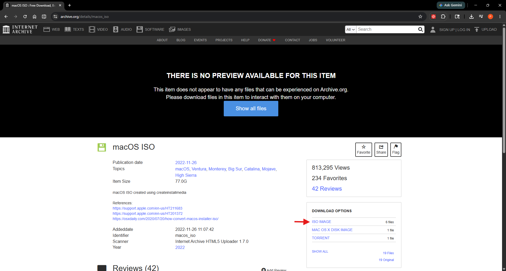

This will expand a list of options. Personally, I've only had a successul install with **BigSur** and **Monterey** so far, with **BigSur** giving me an easier time, so I'd recommend going with it. I will be assuming you chose **BigSur** moving forward.

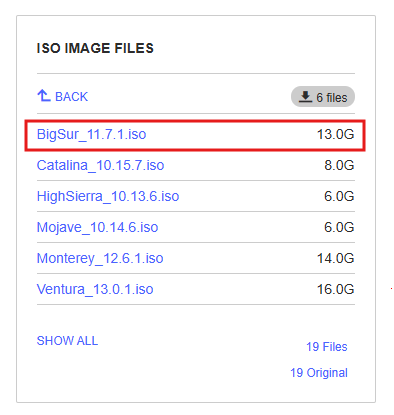

Click the **BigSur** option to download it. 

*Note: Beware that the file is fairly large (13GB), so it may take quite a while to finish downloading.*

## Disable Conflicting Windows Features

Here, you will be turning off **Memory Integrity** and disabling **Hyper-V** in your host machine. The reason for this is because these features use the same hardware virtualization extentions as **VirtualBox** which creates a conflict that causes performance issues in the VMs. While other VMs like Linux may still run well enough, macOS is particularly sensitive to this and may not even boot up, let alone run. It sounds sketchy, I know, but these features can always be turned back on when the macOS VM is not in use.

### Step 1: Turn off Memory Integrity
On the taskbar, click **Search** then type in "**core isolation**". You may click to open either under **Best Match** on the left or click **Open** on the right as indicated in the image below.

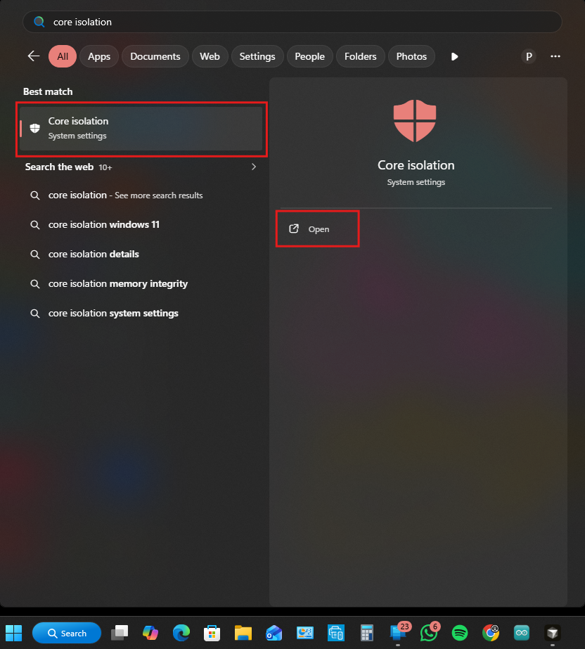

This will bring up a **Windows Security** window where you may turn off **Memory Integrity**.

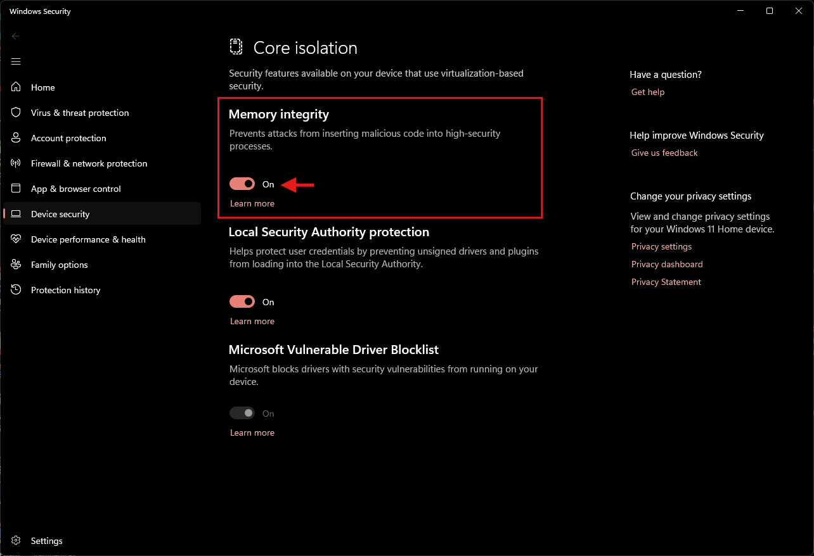

Click the switch to turn it **Off** and click **Yes** when/if prompted. **Memory Integrity** will be turned off after a brief moment and you will be propted to restart your device. **DO NOT restart just yet.**

*Note: You may follow this same process to turn **Memory Integrity** back on, clicking the switch to the **On** position and restarting your device when prompted.*

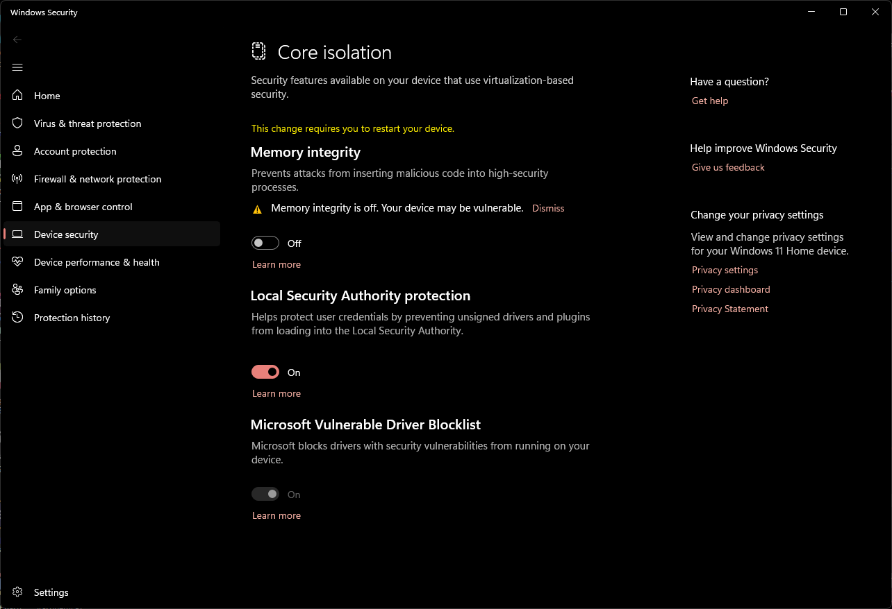

### Step 2: Disable Hyper-V
Open and elevated instance of **Command Prompt** (Run as Adminisrator) and click **Yes** when/if prompted.

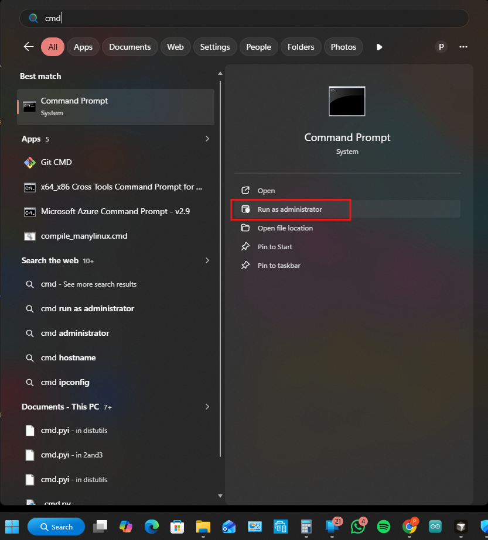

In the **Command Prompt** window, run the following command to turn off **Hyper-V**.

```bash
bcdedit /set hypervisorlaunchtype off
```

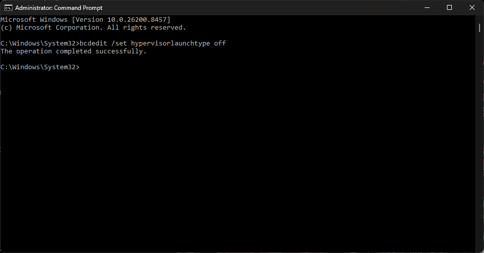

*Note: You can re-enable **Hyper-V** by running the following command, then restarting the your device.*

```bash
bcdedit /set hypervisorlaunchtype auto
```

### Step 3: Restart your device
Now, you may restart your device to allow the changes in the previous two (2) steps to take effect.

*Note: I've included Notes on how to undo these changes in the steps, but for the sake of re-iteration; You can follow the process in Step 1 and click the switch back to the **On** position, follow Step 2 and run the command `bcdedit /set hypervisorlaunchtype auto` instead, then restart your device to both turn on **Memory Integrity** and re-enable **Hyper-V**.*

## Create the VM

Welcome back! Now it's time to finally create the VM.

### Step 1: Name your VM and choose `.iso` file

Open **VirtualBox** and click **New** or press `[Ctrl] + [N]` keys to open the **New Virtual Machine** window. Here, you will give the VM a name (I've opted for the name macBS, as in BigSur >.>) and select the `.iso` file in the **ISO Image** feild--click the dropdown and click **Other...** and find that BigSur `.iso` file you downloaded earlier (you know, the 13GB one). You may choose your VM Folder or use the default one (I used my default), and the other fields should auto-populate. Once done, click **Specify virtual hardware** as indicated in the image below.

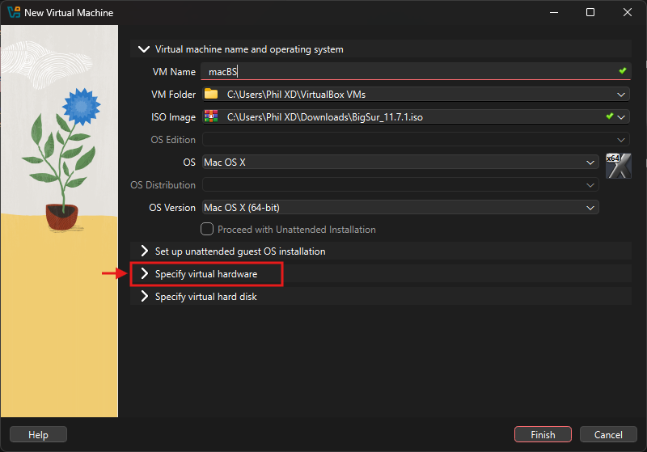

### Step 2: Vitual Hardware

Here, you will allocate CPU cores and RAM to the VM. The minimum requirements to run the OS is 4GB of RAM and 2 CPU cores. I opted to use 6GB of RAM and 3 CPU cores. If you have more resources to spare, feel free to use more. Also, uncheck **Use EFI** (we will re-enable it later).

*Note: The RAM is measured in MB. 1GB = 1024MB. Therefore, 6GB = 6144MB. You already knew that though, yeah?*

Next, click **Specify virtual hard disk**.

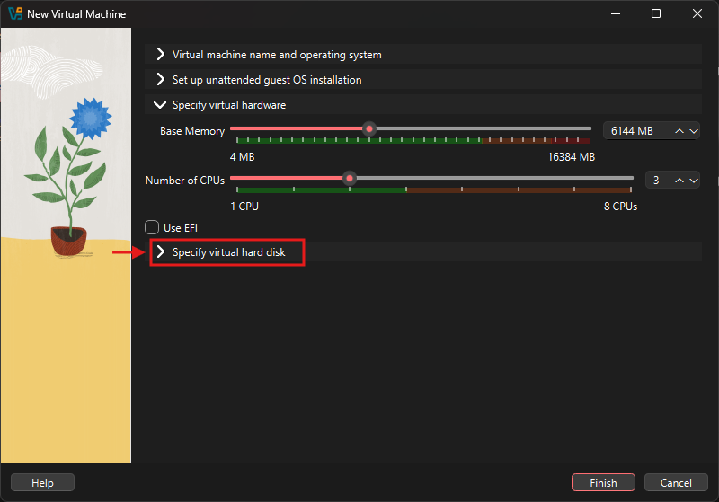

### Step 3: Vitual Hard Disk

BigSur requires a minimum of 35.5GB to run, with the later releases of macOS requiring at least 44.5GB (or so says the internet). I'd reccomend using at least 80 to 100GB. For the purpose of this demo, however, I'm assigning 2TB which will be dynamically allocated as needed. It's overkill and I'll NEVER get any where close to filling that much storage in the VM anyway, but why not? Regardless of if you choose the full 2TB or not, let **VirualBox** dynamically allocate disk space; **DO NOT check "Pre-allocate Full Size"**.

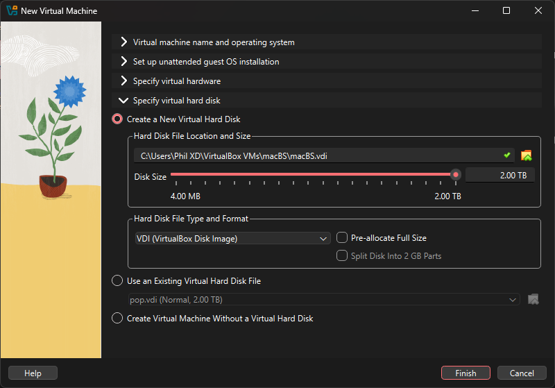

Click "**Finish** when done.

## Tweak VM Settings

At this point, the VM is already created, but some settings must be tweaked.

### Step 1: System Settings

In **VirtualBox**, select your newly created VM and right-click and click **Settings** or click **Settings** from the options near the top or press the keys `[Ctrl] + [S]` on your keyboard. Either of those will open the VM Settings.

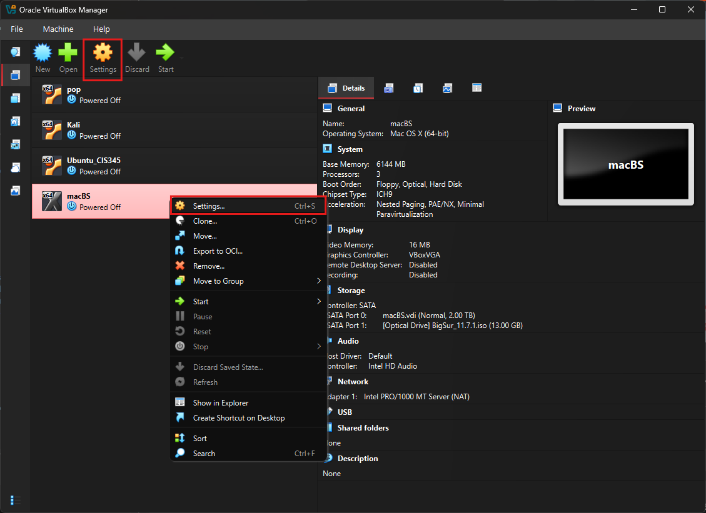

In the **Settings**, ensure it is set to **Expert** on the top-left of the window. Take note of the **VM Name** (you'll need it later) and scroll to **System**. Uncheck "**Floppy**" in **Boot Device Order**, then check **UEFI** (EFI was unchecked earlier). Having UEFI enabled prevents you from adjusting the **Boot Device Order**.

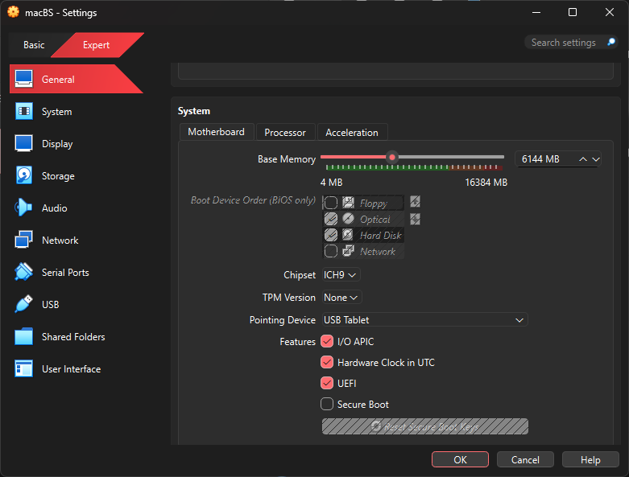

### Step 2: Display Settings

Scroll to **Display**. There, set **Video Memory** to max (128MB) and **Graphics Controller** to "**VBoxSVGA**". You may get an error notifications saying "**Invalid settings detected**", but you can ignore it.

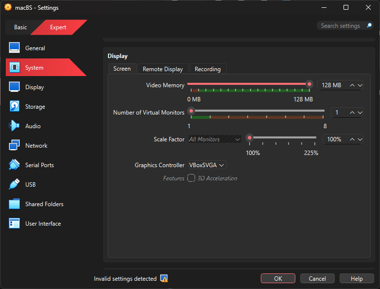

### Step 3: Network Settings

Scroll down to **Network**. In the **Adapter 1** tab, for **Atatched to**, select "**Bridged Adapter**". The other fields should auto populate; if not, then select the appropriate options for your network adapter.

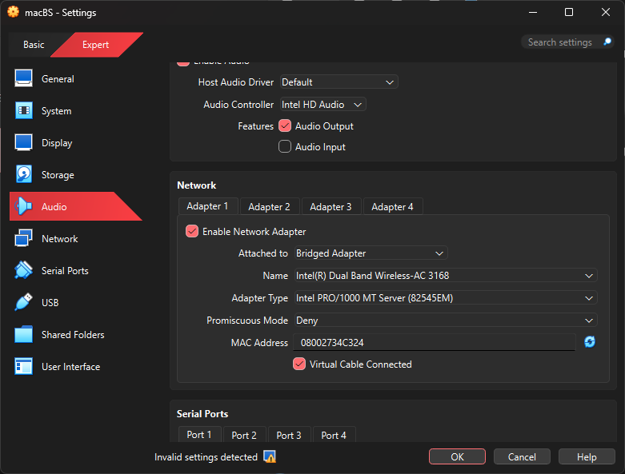

### Step 3: USB Settings

Scroll down to **USB** and select "**USB3 (xHCI) Controlloer**"

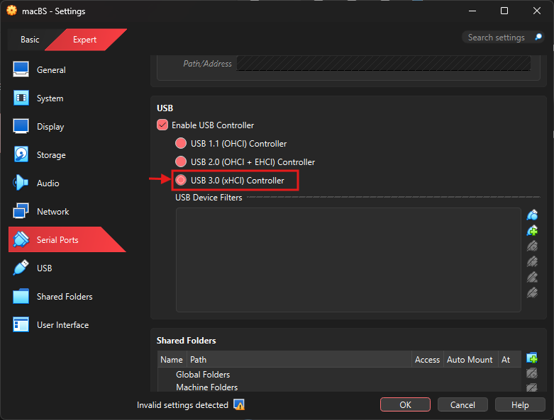

Click **Ok** to save the all the settings.

## Configure the VM via Command Prompt

Additional configurations need to be made to the VM via **Command Prompt** before it can run. You will need to exit **VirtualBox** for now.

### Step 1: Edit commands
If you haven't yet, exit (close) out of **VirtualBox**. Then open a new blank **Notepad**. Copy the following commands and paste them into the **Notepad**.

*Note: There's are separate commands for Intel and AMD CPUs. It's a minor difference--one line, actually--but it is critical to the configuration on an AMD CPU. macOS doesn't play nice with AMD CPUs since Apple has never used them, so you're basically making it seem like the VM is using an Intel CPU known to work with macOS. Use the appropriate commands according to you own CPU.*

Use these commands for Intel:

```bash
VBoxManage setextradata "your_vm_name" "VBoxInternal2/EfiGraphicsResolution" "1920x1080"
VBoxManage modifyvm "your_vm_name" --vram 256
VBoxManage modifyvm "your_vm_name" --cpuidset 00000001 000106e5 00100800 0098e3fd bfebfbff
VBoxManage setextradata "your_vm_name" "VBoxInternal/Devices/efi/0/Config/DmiSystemProduct" "iMac19,3"
VBoxManage setextradata "your_vm_name" "VBoxInternal/Devices/efi/0/Config/DmiSystemVersion" "1.0"
VBoxManage setextradata "your_vm_name" "VBoxInternal/Devices/efi/0/Config/DmiBoardProduct" "Mac-AA95B1DDAB278B95"
VBoxManage setextradata "your_vm_name" "VBoxInternal/Devices/smc/0/Config/DeviceKey" "ourhardworkbythesewordsguardedpleasedontsteal(c)AppleComputerInc"
VBoxManage setextradata "your_vm_name" "VBoxInternal/Devices/smc/0/Config/GetKeyFromRealSMC" 0
VBoxManage setextradata "your_vm_name" "VBoxInternal/TM/TSCMode" "RealTSCOffset"
```

Use these commands for AMD:

```bash
VBoxManage setextradata "your_vm_name" "VBoxInternal2/EfiGraphicsResolution" "1920x1080"
VBoxManage modifyvm "your_vm_name" --vram 256
VBoxManage modifyvm "your_vm_name" --cpuidset 00000001 000106e5 00100800 0098e3fd bfebfbff
VBoxManage setextradata "your_vm_name" "VBoxInternal/Devices/efi/0/Config/DmiSystemProduct" "iMac19,3"
VBoxManage setextradata "your_vm_name" "VBoxInternal/Devices/efi/0/Config/DmiSystemVersion" "1.0"
VBoxManage setextradata "your_vm_name" "VBoxInternal/Devices/efi/0/Config/DmiBoardProduct" "Mac-AA95B1DDAB278B95"
VBoxManage setextradata "your_vm_name" "VBoxInternal/Devices/smc/0/Config/DeviceKey" "ourhardworkbythesewordsguardedpleasedontsteal(c)AppleComputerInc"
VBoxManage setextradata "your_vm_name" "VBoxInternal/Devices/smc/0/Config/GetKeyFromRealSMC" 0
VBoxManage modifyvm "your_vm_name" --cpu-profile "Intel Core i7-6700K"
VBoxManage setextradata "your_vm_name" "VBoxInternal/TM/TSCMode" "RealTSCOffset"

```
Once pasted in the **Notepad** use `[Ctrl] + [H]` to bring up the **Find and Replace** tool. In the top-field, enter "**your_vm_name**". In the bottom field, fill in the VM name you took note of earlier (macBS, in my case). Then, click **Replace all** and close the **Find and Replace** tool.

*Note: I'm on an Intel CPU for this demo, so I'm using the commands specific to Intel.*

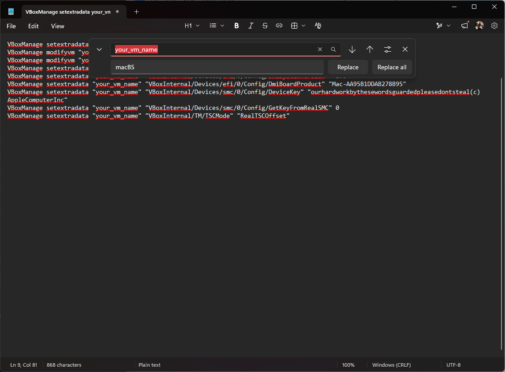

This will fill in your actual VM name to all the commands.

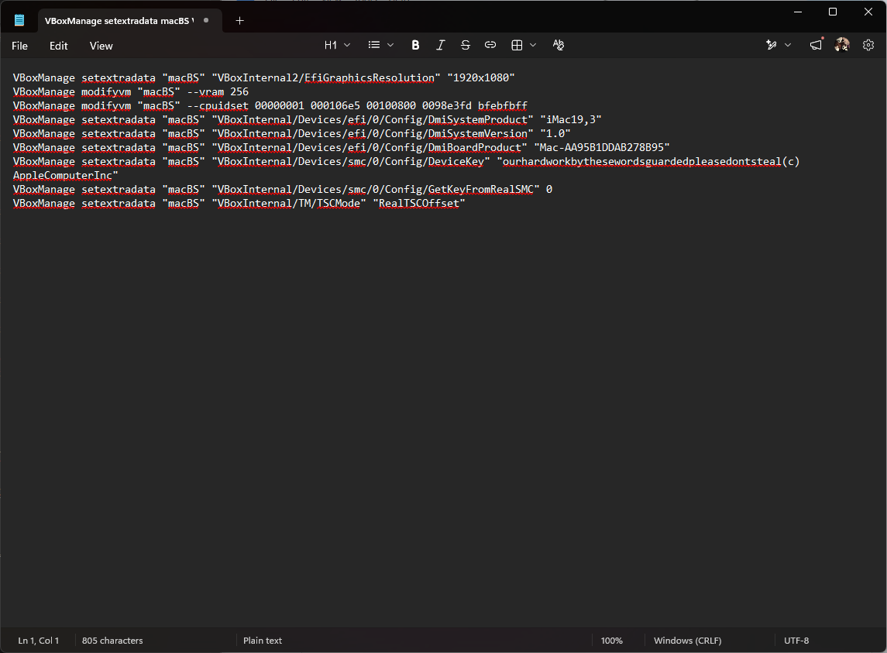

In the first line, the graphics resolution is set to 1920x1080, which is my own actual display resolution. Feel free to change that to your own display resolution (right-click an empty spot on your Desktop, click Display Settings, and scroll down to Display Resolution to see it if you don't already know it) or choose one from the table below.

|    HD    |    FHD    |    QHD    |     2K    |     4K    |
|:--------:|:---------:|:---------:|:---------:|:---------:|
| 1280x720 | 1920x1080 | 2560x1440 | 2048x1080 | 3840x2160 |

### Step 2: Run Commands
Open an elevated instance of **Command Prompt** (Run as Administrator) and enter `cd "C:\Program Files\Oracle\VirtualBox\"` to navitgate to the loction of VirtualBox in your **Program Files**. Then, run the commands from your Notepad. 

You can choose to  select all and copy, paste in Command Prompt (right-click will paste in CMD), and hit `[Enter]` to run:

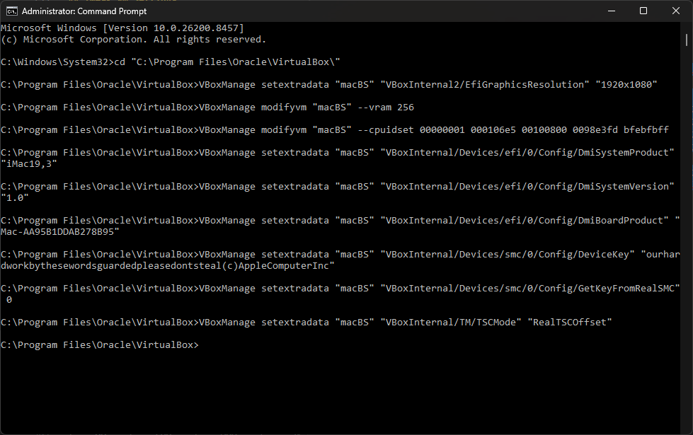

Or copy/paste and run them one at a time (my personal choice):

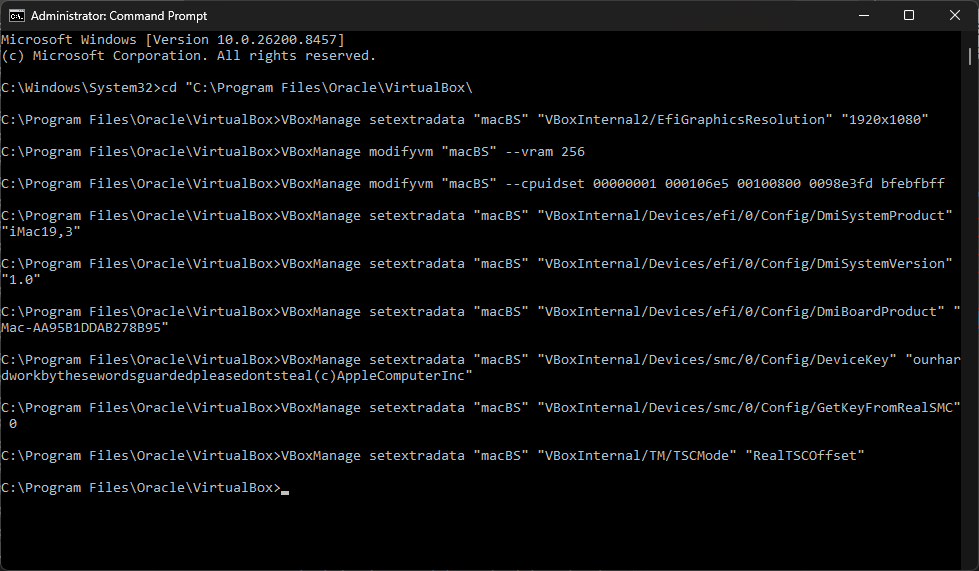

## Install macOS in VM
After all this set up, it's FINALLY time to install the OS in the VM.

### Step 1: Launch VM
Open **VirtualBox** and click *Start** or double-click your VM to launch it. If you've done all the steps above correctly, it should open up and show the Apple logo, some intimidating scrolling text, and a loading bar. That's perfectly normal. It will eventually boot up to a language selection screen.

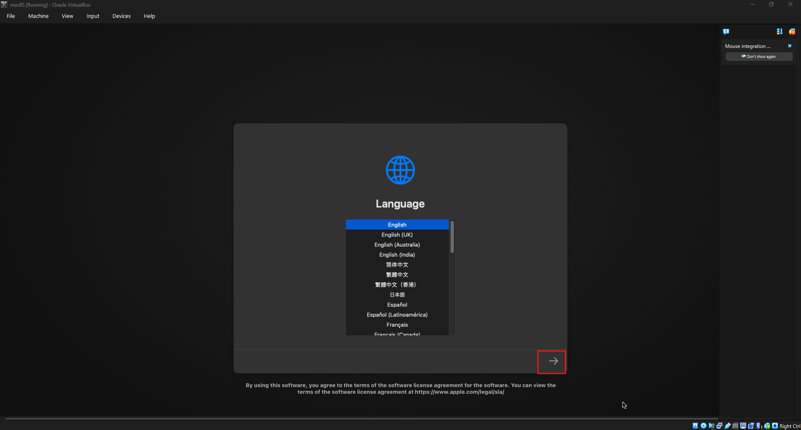

Select your language and click the arrow.

### Step 2: Format Disk
Select **Disk Utility**, and continue.

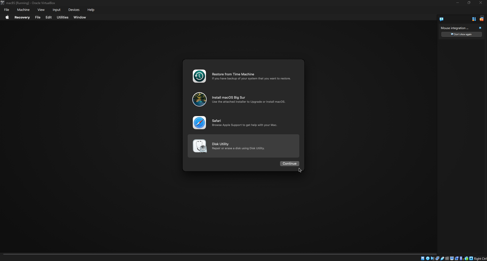

In the left pane of the window, click **VBOX HARDDISK Media**, then click **Erase** near the top-right of the window.

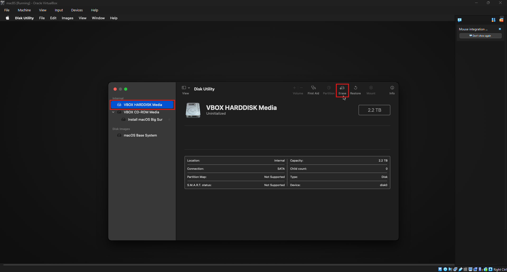

Give your disk a name, then click the **Erase** button.

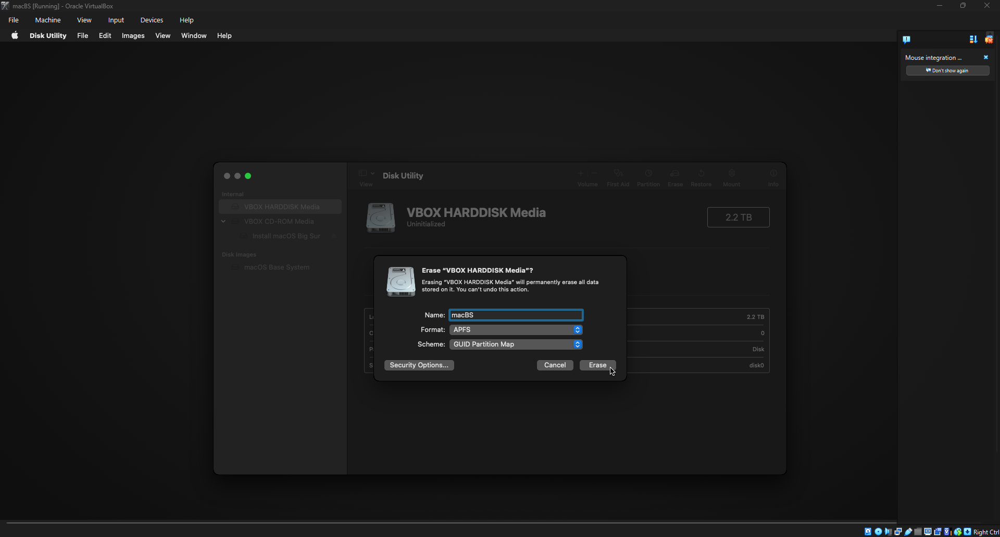

After formatting, click **Done**, and exit **Disk Utility** (red button, top left of the window).

### Step 3: Install OS
Select **Install macOS Big Sur** and click **Continue**. Click **Continue** again and **Agree to the Terms and Conditions**. Select the formatted drive and click **Continue** to begin the installation.

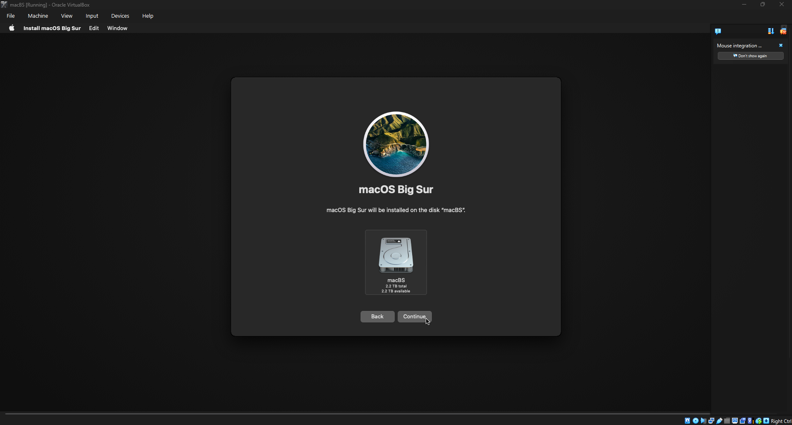

Disregard the remaining time below the loading bar. This installation will take a REALLY long time--up to about 3 hours in some cases--and the VM will reboot several times during this process. Hope you have nothing else to do right now.

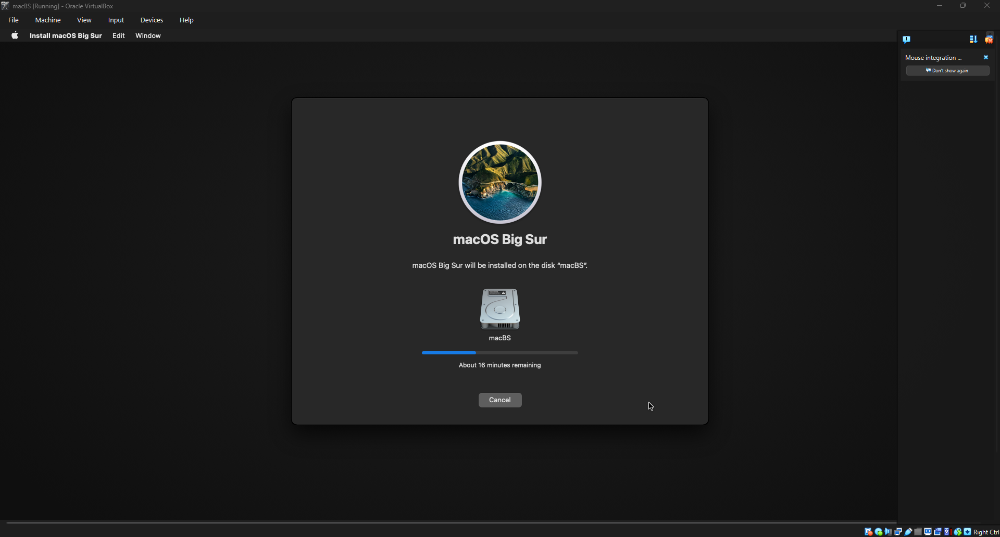

### Step 4: Initialize macOS
With enough time and patience, you will (hopefully) see the Country/Region Selection screen. If you make it here, you're officially past the most arduous part of this insallation. Congrats!

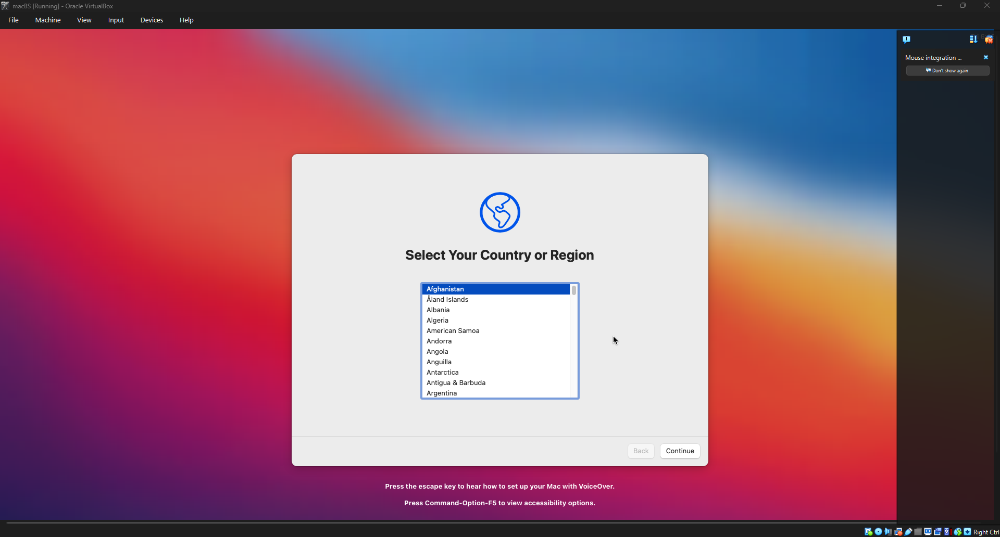

*Note: The following is fairly straight forward, so I sort of speed right through it. My apologize if it seems rushed.*

Select your Country/Region and click **Continue**. 

Verify your **Witten and Spoken language**, and **Continue**. 

Assuming you don't need to setup **Accessibility** settings at the moment, click **Not Now**.

Click **Continue** for **Data & Privacy**.

Click **Not Now** for **Migration Assistant** (lower left of the window).

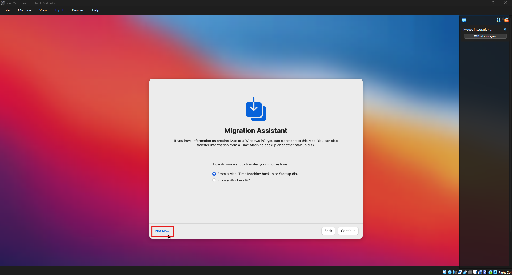

Click **Set Up Later** for **Sign in with Your Apple ID**(again, lower left).


Click **Skip** on the pop-up.

Agree to the Terms and Conditions.

Fill in the info to C**reate a Computer Account** and **Continue**.

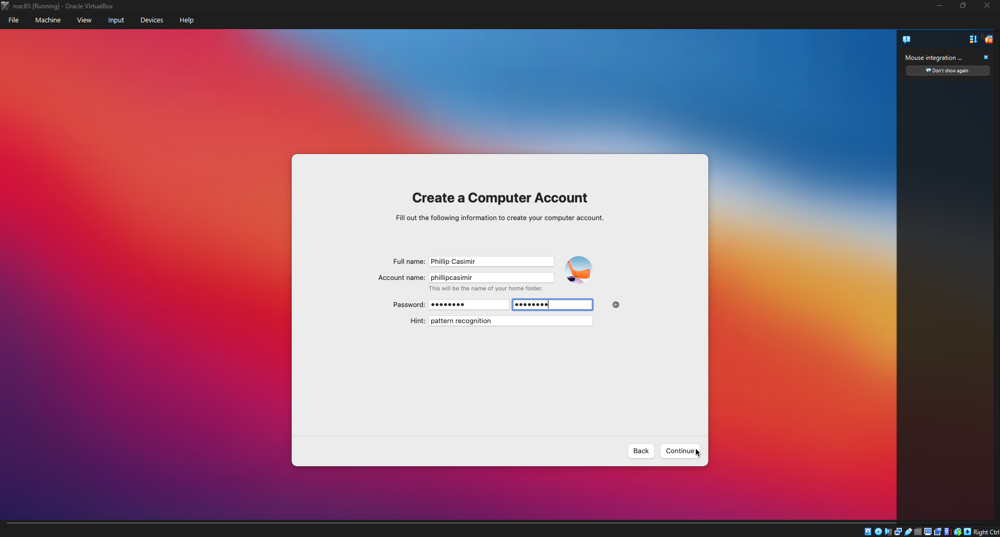

**Continue** on **Express Set Up** and **Analytics**.

**Set Up Later** for **Screen Time** (lower left).

Choose whether or not to Enable Siri (I chose not to) and **Continue**.

For **Choose Your Look**, I chose Auto.

If you get a **Keyboard Setup Assistant**, click **Continue** to work through the set up and ensure your keyboard works.

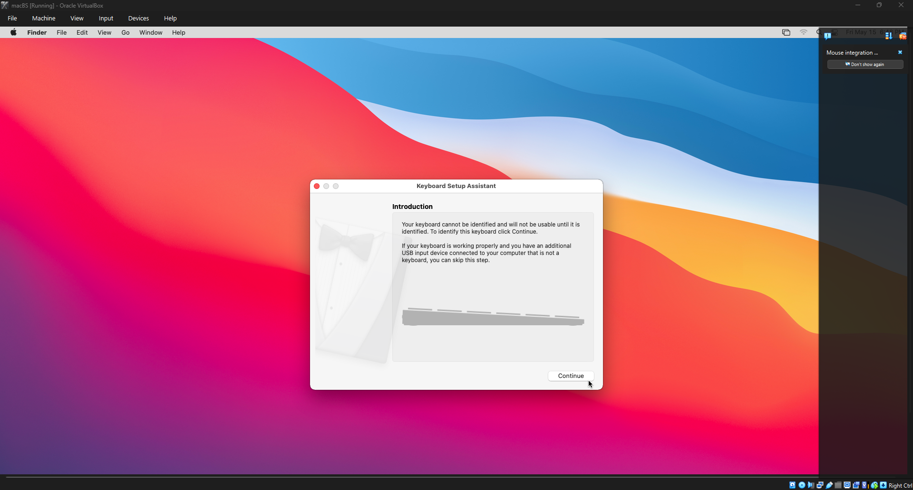

At long last, you're done! You now have a macOS VM running in **VirtualBox**! 

If your can't see your Dock on the bottom of the screen: Click on **View** on the **VirtualBox** menu bar (not to be confused with the mac one) and click **Scaled Mode**.

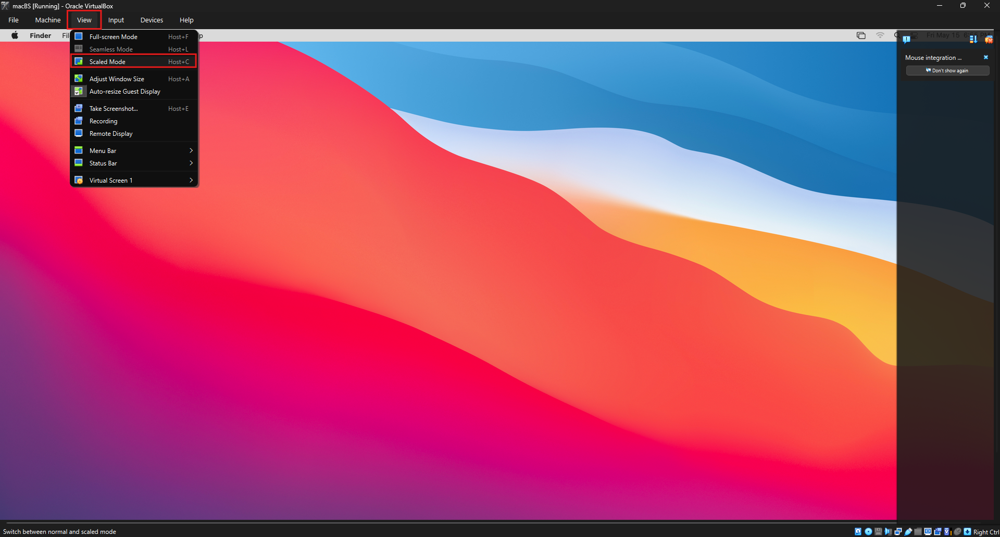

There you have it. macOS Big Sur is now yours to explore as you please!

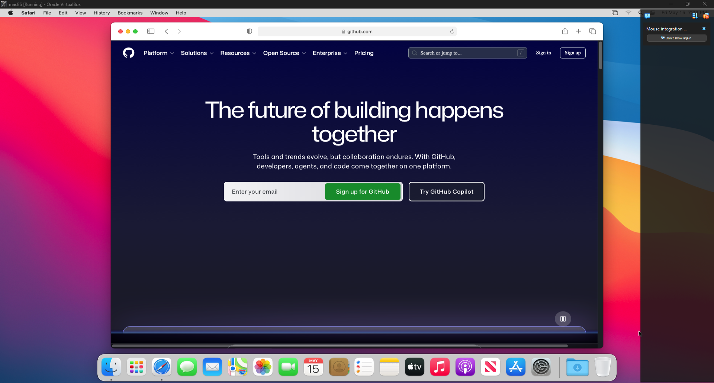

***Note: To iterate once more, if you're concerned about Memory Integrity and Hyper-V, you can turn on and re-enable those at this point. It is completely up to you whether these features remain active or if you choose to turn them off to use the VM. The VM is still usable while those features are active, but it will impact the performance of the VM. User discretion is advised.***